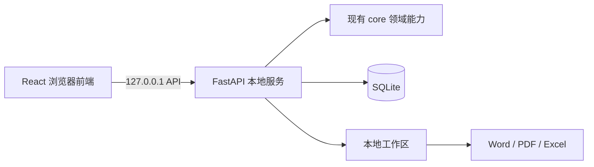

# 利润宝 Web 前后端重构设计说明

> 状态：已确认，等待实施计划  
> 确认日期：2026-08-05  
> 目标：在仅本机浏览器访问的前提下，将 Tk 桌面界面迁移为 Web 前后端应用，完整保留既有功能、计算口径、合规提示与导出成品。

## 1. 目标与边界

- Web 版仅服务当前电脑：后端只监听 `127.0.0.1`，不提供局域网或公网访问。
- 使用 SQLite 保存客户、导入记录、诊断会话、互动决策、预算草稿和导出记录。
- 原始上传文件和导出文件存放于应用专用的本地工作区；浏览器通过上传和下载交互。
- 保留 `main.py` 与 `gui.py` 作为 Tk 验收基线，直到 Web 版全量验收通过才移除或调整默认入口。
- 财务计算、诊断、互动状态机、预算模板校验和 Word/PDF/Excel 导出必须继续复用 `core/`，不得重写形成第二套业务规则。

## 2. 技术架构

| 层次 | 选择 | 职责 |
|---|---|---|
| 前端 | React + Vite | 页面、状态展示、文件上传下载、交互动效与本地 API 调用 |
| 后端 | FastAPI | 本机 API、工作区管理、会话协调、SQLite 持久化、导出响应 |
| 领域层 | 现有 `core/` | 解析、指标计算、诊断、互动、预算、报告与测算模型 |
| 持久化 | SQLite | 可恢复的本地业务状态与导出记录 |
| 启动 | macOS `.command` | 同时启动后端与前端，并自动打开默认浏览器 |

## 3. 前端体验

前端视觉借鉴 2xa.studio 的深色颗粒氛围、窄幅高对比标题、鲜明色块和克制转场，但不复制第三方图形、文案或页面结构。界面以桌面浏览器为主，同时保证窄窗口下的可读性。

- 固定侧栏：总览、财报导入、模板工作台、诊断、互动、第二稿与导出、设置。
- 顶部状态区：企业名称、数据状态、当前步骤和合规提示。
- 内容区：指标卡片、数据表、诊断发现、A/B/C 决策卡、抽屉式详情和导出任务状态。
- 第一阶段先用模拟数据交付可浏览的完整界面外壳；随后逐项替换为真实 API 数据。

## 4. 迁移范围与顺序

1. Web 应用外壳、本地启动脚本、侧栏、总览和设计系统。
2. 财报导入：单文件/分文件 Excel、CSV、示例数据、企业与行业信息。
3. 第一轮诊断：年度指标、行业对标、诊断发现与合规提示。
4. 互动：A/B/C 选项、战略意图、决策记录、第二稿、落地性与最终确认。
5. 导出：Word、PDF、Excel 测算模型及导出记录。
6. 模板工作台：84 行模板、顶部输入、筛选搜索、明细编辑和三类导出。
7. 设置与 AI 可选增强：默认离线；密钥仅留在本次后端进程内存中，不写入 SQLite。

## 5. 数据与安全规则

- SQLite 与本地工作区的路径由后端统一管理，前端不得取得任意文件系统访问权限。
- 原模板导出继续执行规范化路径比较，目标文件不得覆盖输入模板。
- 增值税税负率始终显示为“估算值（基于税金及附加反推）”。
- 未配置 AI 时，所有诊断和互动均使用现有规则引擎完成，不触发网络请求。
- 所有建议仅限合法税务筹划，导出报告继续包含合规声明。

## 6. 验收与回退

- 既有 `tests/` 保持为 `core/` 的回归基线。
- 增加 API 测试：导入、诊断、互动、预算编辑、导出、输入异常和离线回退。
- 增加浏览器端到端测试：财报闭环与 84 行模板工作台闭环。
- 每个迁移模块均执行 Tk 基线与 Web API 对照：金额、比例、发现、决策状态、报告章节和 Excel Sheet 必须一致。
- 发布前 `.command` 执行前端构建、后端测试、核心回归和 Web 端到端测试；任一失败即保留 Tk 默认入口。
- 出现 Web 问题时，仍可通过 `main.py` 启动原 Tk 版，不会改变原始导入文件。

> 注：Tk 桌面端已于 2026-08 移除（`gui.py`/`main.py` 删除），Web 为本项目唯一入口；「Tk 基线与 Web 对照」「可回退 Tk」为当时设计假设，现以 Web 测试/端到端为唯一验收口径。

## 7. 实施约束

- 新增依赖需登记到项目依赖白名单与守护脚本的模块清单。
- `core/` 不得依赖 Web 或 GUI 层；Web 后端仅适配 `core/` 的输入输出。
- 数据处理只在本机完成，未经明确授权不得向外部服务发送客户财务数据。
- 所有新文件遵循项目智能体标识与日期时间命名规范。
